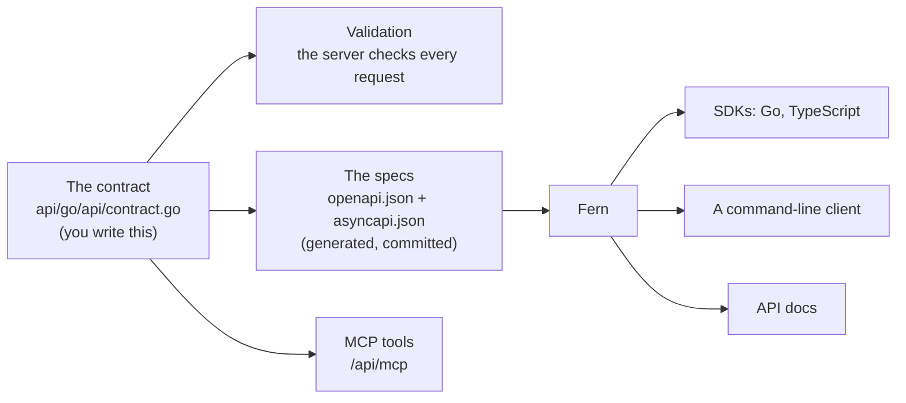

# Contract first: one definition, everything else derived

Why a project made by `dev new` has one file that defines the API, and why the specs, the validation, the clients and the tools for AI agents are never written by hand. Read it to decide whether this way of working suits your team, and to know what you may edit and what you may not.

## The one idea

You write the API once, as Go code: its routes, its inputs and its outputs. That code is the contract. Everything else that describes or checks the API is derived from it by a program.



Nothing on the right of the contract is a second description that someone keeps in step. The server cannot accept what the spec forbids, and an SDK cannot offer what the server lacks, because all three come from the same lines.

## What the contract is in Go

The contract is a list of [Huma](https://huma.rocks) operations in `api/go/api/contract.go`. An operation is its method, its path, an input struct and an output struct. The struct tags are the schema:

```go
type ListInput struct {
	Cursor string `query:"cursor" doc:"Opaque cursor from the previous page's next_cursor"`
	Limit  int32  `query:"limit" minimum:"1" maximum:"100" default:"20"`
}
```

Those two lines say that the operation takes two query parameters, that `limit` is a number from 1 to 100 and is 20 when left out. Huma reads the tags twice: at run time, to validate each request before your handler sees it, and when the specs are written, to produce the schema. A request with `limit=500` is refused with a 422 that names `query.limit`, and the OpenAPI spec says `maximum: 100`. Neither was written separately.

Four more things live in the contract, so that they too have one source:

- **A rule the tags cannot say** goes in the input's `Resolve` method, in Go. The notes example uses one to refuse a note body that contains the stream's end marker.
- **What the generated clients need:** the operation's id and tags name the SDK's methods, and the operation's extensions carry Fern's settings for pagination and streaming.
- **The WebSocket.** An operation marked as a channel is written to the AsyncAPI spec instead of the OpenAPI one, with the type of its messages.
- **The document's own facts:** the API's title, version and description.

The handlers in `api/go/api/handlers.go` implement the contract. They are ordinary Go functions that take the input struct and return the output struct. Go's compiler holds them to those types.

## What is derived, and what you never edit

| Derived from the contract | By | You edit it |
|---|---|---|
| Validation of every request, and the error a bad one gets | Huma, at run time | No: change the tags |
| `sdk/fern/apis/api-go/openapi.json` | `mise run api:go:spec` | Never |
| `sdk/fern/apis/api-go/asyncapi.json` | `mise run api:go:spec` | Never |
| The same two specs served at `/api/openapi.json` and `/api/asyncapi.json` | The server, on request | No |
| The MCP tools at `/api/mcp`: one per operation that answers once | The server, on request | No |
| The SDKs, the command-line client and the API docs in `sdk/out/` | Fern, from the two spec files (`mise run sdk:gen`) | Never: they are not even committed |

The two spec files are generated and still committed. That is on purpose: Fern reads them from the repository, a reviewer sees an API change as a diff of the spec, and a release can ship them.

A hand edit to a generated file is lost the next time the task runs. Worse, until then it makes the spec say something the server does not do.

## How drift is caught

A committed spec can fall behind the contract: someone changes `api/go/api/contract.go` and forgets to write the specs again. One task catches it:

```sh
mise run api:go:spec:check   # fails if a committed spec differs from what the contract gives
```

It generates both specs in memory and compares them with the committed files, byte for byte. It is part of `mise run check`, and so of the check workflow on every push. A stale spec cannot be merged unnoticed.

The fix is always the same:

```sh
mise run api:go:spec         # write the specs again from the contract
```

The comparison includes the server's URL (`API_GO_URL`), which the specs name. So changing that URL also needs the specs written again ([Configuration](../reference/config.md#local-settings-miselocaltoml)).

## Where Fern fits, and what it does not do

[Fern](https://buildwithfern.com) reads the two spec files and writes clients: SDKs in Go and TypeScript, a command-line program, and API docs. It runs on your machine, in Docker, when you ask for it.

Fern does not write servers. It never sees your Go code, and nothing it generates runs on Cloudflare. The server is yours: Huma, your handlers, and the packages in [Go packages](../reference/packages.md). The direction is one way: from the contract to the specs to the clients. Nothing flows back.

This also means Fern can be replaced. The specs are plain OpenAPI and AsyncAPI, and any other generator that reads them can take its place. Only the Fern settings in the contract (the `x-fern-` extensions) and `sdk/fern/apis/api-go/generators.yml` are specific to it.

## What this buys a team

- **One change, one place.** Adding a field is one line in a struct. The validation, the spec, the SDK type and the MCP tool's schema follow from running two tasks.
- **The docs cannot lie.** An API reference written by hand describes what someone meant. This one describes what the server enforces.
- **A client breaks at build time, not in production.** Remove a field, regenerate the SDK, and the code that used the field no longer compiles.
- **Review sees the API.** The diff of `sdk/fern/apis/api-go/openapi.json` in a pull request is the exact change your users will get.
- **Agents get the same API as people.** The MCP tools are the same operations with the same validation, not a second surface to keep safe.

## What it costs

- **The contract can only say what Huma and the two spec formats can express.** A rule outside them lives in code (`Resolve`) and reaches the spec only as prose in a description.
- **Two tasks to remember,** `mise run api:go:spec` after a contract change and `mise run sdk:gen` for the clients. The check catches the first one; nothing catches a client that was not regenerated.
- **Generators have gaps.** Some shapes of API come out wrong in one SDK or another, and the contract is then written around the gap. The ones this project met are listed, with their upstream issues, in [Upstream issues](../upstream.md).
- **A new project's contract is the notes example.** The pattern is proven on that API and on a larger example in the orpc-api repo. Your API may meet a case neither has.

## Where to go next

- Try it: [Getting started](../getting-started.md), step 4.
- Every task named here: [Tasks](../reference/tasks.md).
- Why a Go contract runs on Cloudflare at all, and what that costs: [Go on Cloudflare Workers](workers-go.md).
