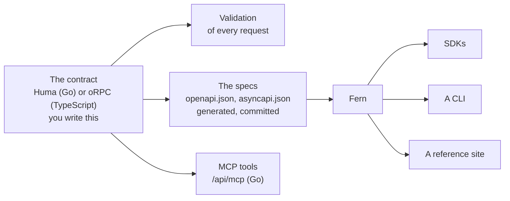

# Contract first: one definition, everything else derived

Why a project has one file that defines the API, and why the specs, the validation, the clients and the tools for agents are never written by hand. Read it to know what you may edit and what you may not.

## The one idea

You write the API once, as code: its routes, inputs and outputs. That is the contract. A program derives the rest.



Nothing right of the contract is a second description that someone keeps in step. The server cannot accept what the spec forbids, and an SDK cannot offer what the server lacks: all three come from the same lines.

## What the contract is

| | Go | TypeScript |
|---|---|---|
| The file | `api/contract.go` | `src/contract.ts` |
| An operation | A [Huma](https://huma.rocks) operation: method, path, an input struct, an output struct | An [oRPC](https://orpc.dev) procedure with `openapi({...})` metadata |
| The schema | The struct tags | Zod schemas |

```go
type ListInput struct {
	Cursor string `query:"cursor" example:"42" doc:"Opaque cursor from the previous page's next_cursor"`
	Limit  int32  `query:"limit" minimum:"1" maximum:"100" default:"20" example:"20"`
}
```

Huma reads those tags twice: at run time, to validate each request before the handler sees it, and when the specs are written. A request with `limit=500` gets a 422 that names `query.limit`, and the spec says `maximum: 100`. Neither was written separately.

Four more things live in the contract, so they too have one source:

- **A rule the tags cannot say:** the input's `Resolve` method.
- **What the generated clients need:** the operation's id and tags, and Fern's `x-fern-*` extensions for names, pagination and streaming.
- **The WebSocket:** an operation marked as a channel goes into the AsyncAPI spec instead of the OpenAPI one.
- **The document's own facts:** title, version, description.

## What is derived

| Derived from the contract | By | You edit it |
|---|---|---|
| Validation, and the error a bad request gets | Huma or oRPC, at run time | No: change the contract |
| `fern/openapi.json`, `fern/asyncapi.json` | `mise run spec` | Never |
| The same specs at `/api/openapi.json` and `/api/asyncapi.json` | The server, on request | No |
| The MCP tools at `/api/mcp` (Go) | The server, on request | No |
| The SDKs and the CLI in `sdk/out/`, and the Go SDK in `sdk/go/` | Fern (`mise run sdk:gen`, `mise run sdk:publish`) | Never |

The two spec files are generated and still committed, on purpose: Fern reads them from the repository, a reviewer sees an API change as a diff of the spec, and a release ships them. The full list of generated files: [What is generated](../README.md#what-is-generated).

## How drift is caught

```sh
mise run spec:check    # fails if a committed spec differs from what the contract gives, byte for byte
mise run spec          # the fix: write them again
```

`spec:check` is part of `mise run check`, and so of the check workflow on every push. The comparison includes the server's URL (`API_URL`), which the specs name: changing the URL needs the specs written again.

## Where Fern fits

[Fern](https://buildwithfern.com) reads the two spec files and writes clients. It runs on your machine, in Docker, when you ask.

- **Fern does not write servers.** It never sees your code, and nothing it generates runs on Cloudflare.
- **The direction is one way:** contract, specs, clients. Nothing flows back.
- **Fern can be replaced.** The specs are plain OpenAPI and AsyncAPI. Only the `x-fern-*` extensions in the contract and `fern/generators.yml` are specific to it.

## What it buys, and what it costs

| It buys | It costs |
|---|---|
| One change in one place: a field is one line, and validation, spec, SDK type and tool schema follow | The contract can only say what Huma or oRPC and the two spec formats can express. A rule outside them lives in code and reaches the spec only as prose |
| The reference cannot lie: it describes what the server enforces | Two tasks to remember: `mise run spec`, which the check catches, and regenerating the clients, which only the committed Go SDK's check catches |
| A client breaks at build time, not in production | Generators have gaps, and the contract is then written around them ([Upstream issues](../upstream.md)) |
| Review sees the API: the spec's diff is the change your users get | |
| Agents get the same operations, with the same validation | |
