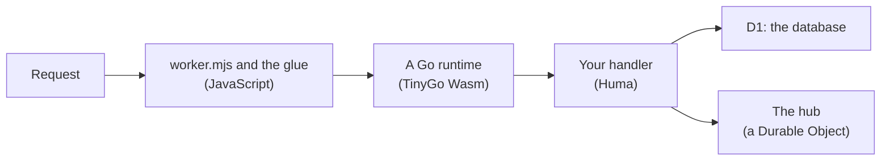

# Huma on Cloudflare Workers: what is different, and what it costs

How a [Huma](https://huma.rocks) API runs on Cloudflare Workers, what is different from a Go server you have written before, and what a request costs. Read it before you choose Go for a Worker, and before you write code that assumes a normal Go process.

## The three-minute version

- **Your API is ordinary Go:** Huma operations and handlers on `net/http` types. The same code runs natively.
- **On Cloudflare it is Wasm,** built by [TinyGo](https://tinygo.org) and connected to the Worker by [workers-go](https://github.com/syumai/workers-go).
- **A Go runtime is not a server process.** It serves one request at a time, for some dozens of requests, and is then replaced. State goes in a binding.
- **It costs what a TypeScript Worker costs** per request ([Benchmarks](../benchmarks.md)). TinyGo and workers-go as they come cost far more: the library and the build here are the difference.
- **A few things are JavaScript,** and some Go libraries do not build with TinyGo.

## How it runs

## A Go runtime is not a server process

A normal Go server starts once and serves for days. Here two requests at the same moment are in two runtimes.

- **Do not count on memory between requests.** A package variable, a cache, a counter: the next request may be in a runtime where it is empty.
- **Do not count on memory being empty either.** The next request may be in the same runtime. Never keep one caller's data in a package variable.
- **State goes in a binding.** What must last goes in D1; what must be shared live goes through a Durable Object. The notes example does both.
- **No background work.** A goroutine must not outlive its request: no ticker, no queue worker.
- **Start-up is paid more often.** What a program does before `main` serves, it does each time a runtime starts. So `humaworkers` registers an operation only when a request first matches it.
- **A stream is one long request.** It keeps its runtime while it is open. A WebSocket's feed and each message the client sends run in runtimes of their own.

A runtime is dropped before Go's collector would have to run in it: the Go side says when its heap has no room for another request (`transport.Serve`), and the glue starts a new one for the request after.

## What Go cannot do there

The JavaScript is the library's (`go/worker/`): the build writes it into your project's `build/` from the library version in `go.mod`. Your project has one entry file of a few lines, `worker.mjs`.

| Go cannot | What does it instead | File in `go/worker/` |
|---|---|---|
| Be the Worker's entry | The glue hands each request to a Go runtime, keeps runtimes between requests, and starts two while the module loads | `go.mjs` |
| Answer a WebSocket upgrade | Go answers with a stream of lines; the adapter sends each as a frame. What the client sends reaches Go as a `POST` | `websocket.mjs` |
| Be a Durable Object class | The hub is a small class with hibernating WebSockets. It stores nothing | `hub.mjs` |
| Rely on its timers | On Cloudflare, not under local workerd, Go timers stalled about half the time. The fix rounds every sleep up to a whole millisecond | `tinygo-clock.mjs` |

Which paths are WebSockets and what they carry stays in the Go contract: the JavaScript only carries bytes ([the protocol](../reference/packages.md#transport)).

## What TinyGo lacks that you will meet

`go test` runs with standard Go and cannot see these. `mise run check` also runs the Wasm under workerd for that reason.

- **The default stack is too small for Huma:** the build passes a bigger one.
- **No `reflect.StructOf`, and `http.ServeMux` does not match method patterns:** `humaworkers` leaves out the Huma hook that needs the first, and routes itself.
- **No `reflect.Value.MethodByName`:** Huma's typed multipart form panics. Take the plain `multipart.Form`.
- **No disk:** `humaworkers` keeps uploads in memory.
- **No MCP SDK builds:** `humamcp` implements the protocol by hand.

Expect the same of other libraries that lean on `reflect`, the file system or parts of `net`: `mise run test:workerd` finds out. The issues: [Upstream issues](../upstream.md).

## What a request costs, and why

A Go Worker built this way costs what the TypeScript one does. The figures, and what each step was worth, are in [Benchmarks](../benchmarks.md). What closed the gap, in order:

1. **The collector no longer runs at every pause:** a patch to a copy of TinyGo's runtime, and an 8 MB starting heap.
2. **Go runtimes are reused between requests,** and two are started while the Worker's module loads.
3. **Goroutine stacks are reused:** a second patch, which TinyGo's dev branch no longer needs.
4. **A request crosses into Go in one call and out in one;** D1 rows cross as one JSON string; the hub is published to by RPC.

Every value that crosses between Go and JavaScript costs: that is the rule behind the last one. TinyGo itself is not rebuilt: the tool pins the TinyGo it was tested with and patches a copy of its runtime source at build time ([wasm-build](../reference/charter.md#wasm-build)).

What still costs:

- **A new isolate,** which Cloudflare starts after a deploy, an idle period, or when traffic spreads. Its first requests cost more.
- **Workers Free allows 10 ms of CPU per request.** Ordinary requests are well inside it; the first in a new isolate are at it. Free is enough to try; plan on Workers Paid for production.
- **A stream,** for as long as it is open.

Measure your own: [Measure and improve performance](../guides/performance.md).

## The same code runs natively

The handlers do not know they are on Cloudflare. They get the database and the hub through one value (`api.Env`), filled in by `platform_js.go` (the bindings) or `platform_other.go` (memory). `mise run run` is standard Go in one process, with storage in memory: quick to develop and debug with, and blind to TinyGo's gaps. `mise run dev` runs the Wasm under workerd with a local D1.

## When it fits

- **A good fit:** your team writes Go and wants one language for the API, its types and its tests; the API is request and response plus streams, with its state in D1 or a Durable Object; you want the same code to run off Cloudflare too.
- **Not a good fit:** you must stay within Workers Free for certain; you depend on Go libraries TinyGo cannot build, or on in-process state (caches, pools, background goroutines); you cannot accept a few JavaScript files and open upstream issues in the path.

For TypeScript, the same design exists on oRPC: [The TypeScript (oRPC) version](../guides/typescript.md).
