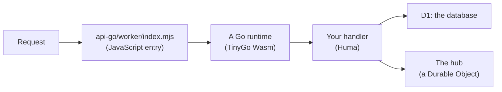

# Go on Cloudflare Workers: what is different, and what it costs

How a Go API runs on Cloudflare Workers in a project made by `dev new`, what is different from a Go server you have written before, and what a request costs. Read it before you choose Go for a Worker, and before you write code that assumes a normal Go process.

## How it runs

A Worker runs JavaScript and WebAssembly, not native programs. So the Go code is compiled to Wasm by [TinyGo](https://tinygo.org), a second Go compiler made for small targets, and [workers-go](https://github.com/syumai/workers-go) connects it to the Worker: it turns each request into an `http.Request`, calls your `http.Handler`, and gives Go access to the Worker's bindings.



The API itself is ordinary Go: [Huma](https://huma.rocks) operations and handlers on `net/http` types ([Contract first](contract-first.md)).

## A Go runtime lives for a few requests

This is the difference that shapes everything else. A normal Go server is one process that starts once and serves requests for days. Here a Go runtime serves a few requests, one at a time, and is then replaced by a new one. Two requests at the same moment are in two runtimes.

What follows from that:

- **Do not count on memory between requests.** A package variable, a cache in a map, a counter: the next request may be in a runtime where it is empty.
- **Do not count on memory being empty either.** The next request may be in the same runtime and see what the last one left in a package variable. As in any Go server, never keep one caller's data there.
- **State goes in a binding.** What must outlast a request is stored in D1 (the database), and what must be shared live between requests goes through a Durable Object. The notes example does both: D1 is the log of notes, and one Durable Object, the hub, tells open streams that a new note exists.
- **No background work.** A goroutine must not outlive its request. There is no place for a ticker, a queue worker or a warm-up.
- **Start-up is paid often.** Everything a Go program does before `main` serves, it does each time a runtime starts: every third request or so. This is why the `humaworkers` package registers an operation only when a request first matches it ([Go packages](../reference/packages.md#humaworkers)).
- **A stream is one long request.** An SSE stream or a WebSocket feed keeps its runtime for as long as it is open. A WebSocket's feed and each message the client sends on it run in runtimes of their own, so they share nothing through memory.

Why only a few requests: TinyGo gives every goroutine, and every call from JavaScript into Go, a stack of its own (128 KB here), and its collector rarely gets that memory back. A hello uses about 1.7 MB of an 8 MB heap. So a runtime is reused while its heap has room for another request, and dropped before the collector would have to run: a collection in a full heap costs far more than starting a new runtime. `api-go/worker/go.mjs` does the reusing, and the Go side says when it is full (`transport.Serve`). workers-go on its own starts a runtime for every request.

## What Go cannot do there, and what does it instead

Four things are JavaScript because Go cannot do them on Workers. They are five small files in `api-go/worker/`, copied into your project, and you rarely touch them.

| Go cannot | What does it instead | File |
|---|---|---|
| Be the Worker's entry | A few lines of JavaScript receive each request and hand it to a Go runtime: one that is waiting, or a new one | `api-go/worker/index.mjs`, `api-go/worker/go.mjs` |
| Answer a WebSocket upgrade | Go answers the upgrade with a plain stream of lines, one JSON message per line. The adapter opens the socket and sends each line as a frame. What the client sends reaches Go as a `POST` | `api-go/worker/websocket.mjs` |
| Be a Durable Object class | The hub is a small JavaScript class with hibernating WebSockets. It stores nothing. Go calls it to publish, and subscribes to it over a WebSocket | `api-go/worker/hub.mjs` |
| Rely on its timers | On Cloudflare (not under the local runtime) Go timers stalled about half the time: `time.Sleep`, timers and context deadlines hung. The fix rounds every sleep TinyGo asks for up to a whole millisecond | `api-go/worker/tinygo-clock.mjs` |

The rule that keeps this small: which paths are WebSockets, what they take and what they send all stay in the Go contract. The JavaScript only carries bytes. The exact protocol between the two is in [Go packages](../reference/packages.md#transport), and how the feed stays gap-free in [How real-time works](../realtime.md).

## What TinyGo lacks that you will meet

TinyGo is not the standard Go compiler, and some of the standard library is missing or different. `go test` runs with standard Go and cannot see these gaps, which is why `mise run check` also runs the tests against the Wasm under workerd, Cloudflare's runtime.

| Gap | What you see | What the project does |
|---|---|---|
| The default stack is too small for Huma | `memory access out of bounds` on the first request | The build passes `-stack-size=128kb` |
| No `reflect.StructOf` | `panic: unimplemented: reflect.StructOf()` from a hook in Huma's default config | `humaworkers.Config` leaves that hook out |
| `http.ServeMux` does not match patterns with a method (`"GET /path"`) | Every route is 404 with Huma's own router | `humaworkers` matches routes itself |
| No `reflect.Value.MethodByName` | Huma's typed multipart form does not work | Take the plain `multipart.Form` and declare its schema on the operation |
| No disk | An upload over 8 KB fails: Huma writes it to a temporary file | `humaworkers` keeps uploads in memory, up to 32 MB |
| No MCP SDK builds with TinyGo | | The `humamcp` package implements the protocol by hand |

Expect the same with other libraries: one that leans on `reflect`, on the file system, or on parts of `net` may not build or may panic at run time. Find out early with `mise run api-go:build` and `mise run api-go:test:workerd`. Each gap that has an upstream issue is tracked in [Upstream issues](../upstream.md).

## What a request costs

On Cloudflare a read costs 2 to 7 ms of CPU and a write that also notifies the hub 10 to 13 ms; the slowest requests cost 9 to 20 ms. The same API in TypeScript uses about 1 ms. Measured 2026-10-01 on the orpc-api project's Workers; the numbers per operation are in [Benchmarks](../benchmarks.md), and what they mean for choosing a plan is on the home page: [Before you choose Go](../README.md#before-you-choose-go-what-it-costs-to-run).

TinyGo and workers-go as they come cost far more: 40 to 70 ms for a read, about 265 ms for a write. Three things in this project make the difference, and a project made by `dev new` has all three:

- **Go runtimes are reused** (`api-go/worker/go.mjs`, above). A request that finds a waiting runtime pays nothing for start-up, and the JavaScript engine has fewer dead runtimes to clear away.
- **The collector does not run in an ordinary request** (`dev wasm-build`, which `mise run api-go:build` runs). TinyGo as it is collects garbage each time the program waits, once 32 JavaScript values have been touched, and each time its small starting heap must grow. The build turns the first off and starts with a heap of 8 MB. A stream that lives for hours still fills the heap, and is collected then.
- **Goroutine stacks are 128 KB, not more.** Stacks are most of what a request allocates.

The change to TinyGo is one constant in a copy of its runtime source. TinyGo itself is not rebuilt, and the change is reported upstream ([tinygo-org/tinygo#5800](https://github.com/tinygo-org/tinygo/issues/5800)). The details are in [the dev tool](../reference/dev.md#wasm-build).

What still costs:

- **About one request in three starts a new runtime** and costs 5 to 13 ms instead of 2 to 3.
- **Every value that crosses between Go and JavaScript costs.** A request, a header, a D1 row, a call to the hub. A write crosses many more times than a read.
- **A new isolate runs slower at first.** Cloudflare's engine optimises the Wasm as it is used. Before the runtimes were reused that doubled every figure; now the figures above were measured right after a deploy.

These numbers are for the notes example. Measure your own API:

```sh
mise run api-go:bench   # every GET operation in your spec: wall time and Cloudflare's CPU time
mise run api-go:perf    # REMOTE: build, deploy, then the same bench
```

## The size limit

A Worker's code has a size limit, counted gzipped. `mise run api-go:build` fails if the Wasm is over 3,000,000 bytes gzipped, the Workers Free limit. The notes example with its MCP endpoint is about 875 KB gzipped (measured 2026-10-01), so there is room, but every package you import is compiled in. The build prints the size each time.

## The same code runs natively

The handlers do not know they are on Cloudflare. They get the database and the hub through one small value (`api.Env`), and two files fill it in: `api-go/platform_js.go` with the Worker's bindings, `api-go/platform_other.go` with an in-memory store and hub.

```sh
mise run api-go:run   # the same API as a normal Go process: http://localhost:5174
```

That build is standard Go, one process, with REST, the SSE stream, the WebSocket and MCP all working. It is how you develop quickly and debug with ordinary Go tools. Two limits: it has no database, so notes are gone when it stops, and it does not show TinyGo's gaps or the per-request runtime. `mise run api-go:dev` runs the real Wasm locally for that.

## When this is a good fit, and when it is not

A good fit:

- **Your team writes Go** and wants one language for the API, its types and its tests.
- **You are on Workers Paid,** or an occasional request over Free's 10 ms limit is acceptable.
- **The API is request and response, plus streams,** with its state in D1 or a Durable Object.
- **You want the same code to run off Cloudflare too,** for development or as a way out.

Not a good fit:

- **You need to stay within Workers Free for certain.** Its limit is 10 ms of CPU per request: reads fit, writes and the slowest requests reach it.
- **Cost per request or latency matters most.** The same API in TypeScript used a small fraction of the CPU, and the orpc-api repository has that version, built on the same design ([its page](../api.md)).
- **You depend on Go libraries TinyGo cannot build,** or on in-process state that must last: caches, pools, background goroutines.
- **You cannot accept workarounds in the path.** This runs on five small JavaScript files and several open upstream issues. Each is small and tracked, but they are there.
