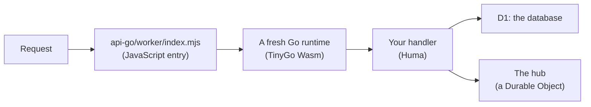

# Go on Cloudflare Workers: what is different, and what it costs

How a Go API runs on Cloudflare Workers in a project made by `dev new`, what is different from a Go server you have written before, and what a request costs. Read it before you choose Go for a Worker, and before you write code that assumes a normal Go process.

## How it runs

A Worker runs JavaScript and WebAssembly, not native programs. So the Go code is compiled to Wasm by [TinyGo](https://tinygo.org), a second Go compiler made for small targets, and [workers-go](https://github.com/syumai/workers-go) connects it to the Worker: it turns each request into an `http.Request`, calls your `http.Handler`, and gives Go access to the Worker's bindings.



The API itself is ordinary Go: [Huma](https://huma.rocks) operations and handlers on `net/http` types ([Contract first](contract-first.md)).

## A fresh Go runtime for every request

This is the difference that shapes everything else. A normal Go server is one process that starts once and serves requests for days. Here, workers-go starts a new Go runtime for each request, and it is gone when the response ends.

What follows from that:

- **No memory between requests.** A package variable, a cache in a map, a connection pool, a counter: each starts empty on every request. Two requests never see each other's memory, even one second apart.
- **State goes in a binding.** What must outlast a request is stored in D1 (the database), and what must be shared live between requests goes through a Durable Object. The notes example does both: D1 is the log of notes, and one Durable Object, the hub, tells open streams that a new note exists.
- **No background work.** A goroutine cannot outlive its request. There is no place for a ticker, a queue worker or a warm-up.
- **Start-up is paid every time.** Everything a Go program does before `main` serves, it does on each request. This is where most of the cost below comes from, and why the `humaworkers` package registers only the one operation a request matches ([Go packages](../reference/packages.md#humaworkers)).
- **A stream is one long request.** An SSE stream or a WebSocket feed keeps its runtime for as long as it is open. A WebSocket's feed and each message the client sends on it run in runtimes of their own, so they too share nothing through memory.

## What Go cannot do there, and what does it instead

Three things are JavaScript because Go cannot do them on Workers. They are four small files in `api-go/worker/`, copied into your project, and you rarely touch them.

| Go cannot | What does it instead | File |
|---|---|---|
| Be the Worker's entry | A few lines of JavaScript receive each request and hand it to the Go Wasm | `api-go/worker/index.mjs` |
| Answer a WebSocket upgrade | Go answers the upgrade with a plain stream of lines, one JSON message per line. The adapter opens the socket and sends each line as a frame. What the client sends reaches Go as a `POST` | `api-go/worker/websocket.mjs` |
| Be a Durable Object class | The hub is a small JavaScript class with hibernating WebSockets. It stores nothing. Go calls it to publish, and subscribes to it over a WebSocket | `api-go/worker/hub.mjs` |
| Rely on its timers | On Cloudflare (not under the local runtime) Go timers stalled about half the time: `time.Sleep`, timers and context deadlines hung. The fix rounds every sleep TinyGo asks for up to a whole millisecond | `api-go/worker/tinygo-clock.mjs` |

The rule that keeps this small: which paths are WebSockets, what they take and what they send all stay in the Go contract. The JavaScript only carries bytes. The exact protocol between the two is in [Go packages](../reference/packages.md#transport), and how the feed stays gap-free in [How real-time works](../realtime.md).

## What TinyGo lacks that you will meet

TinyGo is not the standard Go compiler, and some of the standard library is missing or different. `go test` runs with standard Go and cannot see these gaps, which is why `mise run check` also runs the tests against the Wasm under workerd, Cloudflare's runtime.

| Gap | What you see | What the project does |
|---|---|---|
| The default stack is too small for Huma | `memory access out of bounds` on the first request | The build passes `-stack-size=256kb` |
| No `reflect.StructOf` | `panic: unimplemented: reflect.StructOf()` from a hook in Huma's default config | `humaworkers.Config` leaves that hook out |
| `http.ServeMux` does not match patterns with a method (`"GET /path"`) | Every route is 404 with Huma's own router | `humaworkers` matches routes itself |
| No `reflect.Value.MethodByName` | Huma's typed multipart form does not work | Take the plain `multipart.Form` and declare its schema on the operation |
| No disk | An upload over 8 KB fails: Huma writes it to a temporary file | `humaworkers` keeps uploads in memory, up to 32 MB |
| No MCP SDK builds with TinyGo | | The `humamcp` package implements the protocol by hand |

Expect the same with other libraries: one that leans on `reflect`, on the file system, or on parts of `net` may not build or may panic at run time. Find out early with `mise run api-go:build` and `mise run api-go:test:workerd`. Each gap that has an upstream issue is tracked in [Upstream issues](../upstream.md).

## What a request costs

A request to the Go Worker uses about 40 to 70 ms of CPU on Cloudflare; the same API in TypeScript uses 1 to 3 ms (measured 2026-10-01 on the orpc-api project's two Workers). That fits Workers Paid and not Workers Free, whose limit is 10 ms of CPU per request. What this means for choosing a plan is on the home page: [Before you choose Go](../README.md#before-you-choose-go-what-it-costs-to-run). The numbers per route and how they were measured are in [Benchmarks](../benchmarks.md).

Why it costs that:

- **Most of it is start-up.** A 404, which runs none of your code, already cost 38 ms: that is the fresh Go runtime, on every request.
- **Much of the rest is the garbage collector.** Measured locally, the same build without a collector took about half the time. It is not safe to deploy that way: a stream can live for hours, and its memory would only grow.
- **It is cost, not correctness.** Both Workers pass the same tests.

Nothing is built yet to bring the cost down. The ideas, most promising first, are in the plan: [Performance](../plans/performance.md).

These numbers are for the notes example. Your own API was not measured: run `mise run api-go:bench` against your Worker for wall time, and read CPU time from Workers Logs.

## The size limit

A Worker's code has a size limit, counted gzipped. `mise run api-go:build` fails if the Wasm is over 3,000,000 bytes gzipped, the Workers Free limit. The notes example with its MCP endpoint is about 875 KB gzipped (measured 2026-10-01), so there is room, but every package you import is compiled in. The build prints the size each time.

## The same code runs natively

The handlers do not know they are on Cloudflare. They get the database and the hub through one small value (`api.Env`), and two files fill it in: `api-go/platform_js.go` with the Worker's bindings, `api-go/platform_other.go` with an in-memory store and hub.

```sh
mise run api-go:run   # the same API as a normal Go process: http://localhost:5174
```

That build is standard Go, one process, with REST, the SSE stream, the WebSocket and MCP all working. It is how you develop quickly and debug with ordinary Go tools. Two limits: it has no database, so notes are gone when it stops, and it does not show TinyGo's gaps or the per-request runtime. `mise run api-go:dev` runs the real Wasm locally for that.

## When this is a good fit, and when it is not

A good fit:

- **Your team writes Go** and wants one language for the API, its types and its tests.
- **You are on Workers Paid,** and the CPU cost per request above is acceptable for your traffic.
- **The API is request and response, plus streams,** with its state in D1 or a Durable Object.
- **You want the same code to run off Cloudflare too,** for development or as a way out.

Not a good fit:

- **You need Workers Free.** Its 10 ms limit rules it out.
- **Cost per request or latency matters most.** The same API in TypeScript used a small fraction of the CPU, and the orpc-api repository has that version, built on the same design ([its page](../api.md)).
- **You depend on Go libraries TinyGo cannot build,** or on in-process state: caches, pools, background goroutines.
- **You cannot accept workarounds in the path.** This runs on four small JavaScript files and several open upstream issues. Each is small and tracked, but they are there.
