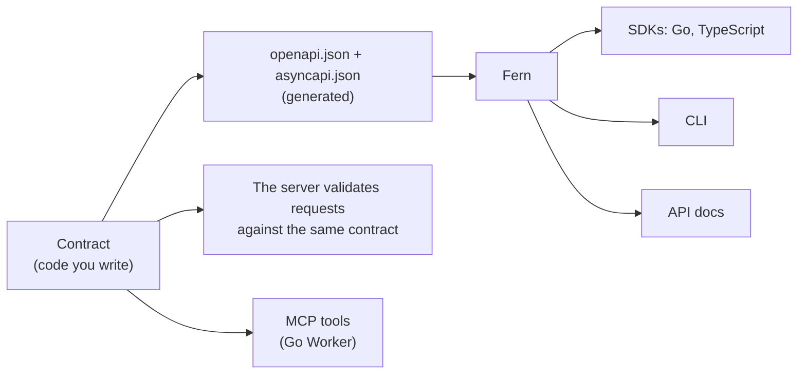

# This repository: how it is built and kept

For people and agents changing charter itself. If you are building an API with it, you want [Getting started](getting-started.md) and the [guides](guides.md).

| Page | What it covers |
|---|---|
| [rules.md](rules.md) | The working rules. Read them before changing anything |
| [api-go.md](api-go.md) | `examples/notes-go/`: the Go Worker, and what Huma needs to run on workers-go |
| [api.md](api.md) | `examples/notes-ts/`: the oRPC Worker (TypeScript) |
| [showcase-go.md](showcase-go.md) | The Go showcase: every Fern feature, feature by feature |
| [sdk.md](sdk.md) | `sdk/`: the Fern folders, the showcase in oRPC, the SDK test Worker |
| [mcp.md](mcp.md) | How the MCP endpoint is built |
| [testing.md](testing.md) | `examples/notes-go/test/`: the programs both servers must pass |
| [dev.md](dev.md) | `cmd/charter/`: the tool behind the tasks, the workflows, releases |
| [benchmarks.md](benchmarks.md) | What a request costs on each Worker |
| [upstream.md](upstream.md) | Every upstream issue worked around |
| [findings.md](findings.md) | Verified results only, newest last |
| [plans/structure.md](plans/structure.md) | One project shape for the library, the examples and new projects: the restructure under way |
| [plans/next.md](plans/next.md) | What is not built yet |

## What is what

The one idea: **you write a contract in code; everything else is generated from it.**

### The notes API, twice

There are two contracts for the notes API because there are two servers. They describe the same API, and a test keeps them the same. A real project has one: pick the column for its language.

| | The oRPC Worker (TypeScript) | The Go Worker |
|---|---|---|
| **The contract (the source; you edit this)** | `examples/notes-ts/src/contract.ts` (oRPC + Zod) | `examples/notes-go/api/contract.go` (Huma: Go structs and their tags) |
| The server | `examples/notes-ts/src/index.ts` | `examples/notes-go/api/handlers.go` |
| OpenAPI generator | `@orpc/openapi` | Huma |
| AsyncAPI generator (the WebSocket) | `examples/notes-ts/src/asyncapi.ts` (ours) | `go/asyncapi/` (ours, the same design) |
| Write the specs | `mise run spec` | `mise run spec` |
| **The specs (generated; never edit)** | `examples/notes-ts/fern/*.json` | `examples/notes-go/fern/*.json` |
| Fern's settings for that API | `examples/notes-ts/fern/generators.yml` | `examples/notes-go/fern/generators.yml` |
| Generate an SDK | `mise run sdk:gen <group>` | `mise run sdk:gen <group>` |
| Fern's output (gitignored) | `examples/notes-ts/sdk/out/` | `examples/notes-go/sdk/out/` |
| The feed (gap-free real-time) | `follow()` in `examples/notes-ts/src/follow.ts` | `Follow` in `go/follow/` |
| The hub (a Durable Object with hibernating WebSockets) | `examples/notes-ts/src/hub.ts` (oRPC's) | `go/worker/hub.mjs` |
| The Worker on Cloudflare | `charter-notes-ts` | `charter-notes-go` |
| Deployed at | https://charter-notes-ts.gedw99.workers.dev/api/openapi.json | https://charter-notes-go.gedw99.workers.dev/api/openapi.json |
| MCP endpoint | no | `/api/mcp` |
| Also runs without Cloudflare | no | yes: `mise run run` |
| Check it locally | `mise run check` | `mise run check` |
| Test it deployed | `mise run live-test`, `mise run soak` | `mise run live-test`, `mise run soak` |
| Its page | [api.md](api.md) | [api-go.md](api-go.md) |

Shared by both: `examples/notes-go/test/` (the test programs), `examples/notes-go/migrations/` (the D1 schema), `sdk/` (Fern), `cmd/charter/` (the tool the tasks run).

### The showcase, twice

The showcase is a second, smaller API whose only job is to use every Fern feature: OAuth, idempotency, pagination, SSE, file upload, signed webhooks, a WebSocket both ways, audiences and an overlay. A test keeps its two contracts the same too.

| | The oRPC showcase | The Go showcase |
|---|---|---|
| **The contract** | `examples/showcase-ts/src/contract.ts` | `examples/showcase-go/api/contract.go` |
| The server | `examples/showcase-ts/src/showcase.ts`, served by the harness Worker under `/api/mock` | `examples/showcase-go/api/handlers.go`, run by `examples/showcase-go/` |
| Write the specs | `mise run spec` | `mise run spec` |
| **The specs (generated; never edit)** | `examples/showcase-ts/fern/*.json` | `examples/showcase-go/fern/*.json` |
| The Worker on Cloudflare | `charter-showcase-ts` and `charter-showcase-ts-api` | `charter-showcase-go` |
| Check it locally | `mise run check`, `mise run test:workerd` | `mise run check` |
| Its page | [sdk.md](sdk.md#the-orpc-showcase) | [showcase-go.md](showcase-go.md) |

### The names used in these pages

| Name | What it is |
|---|---|
| The contract | The code that defines an API's routes and schemas. The source of everything else |
| The specs | `openapi.json` and `asyncapi.json`, generated from a contract into a Fern folder |
| A Fern folder | `fern/`: an API's specs and `generators.yml`. A group in that file is one SDK to generate |
| The oRPC Worker, the Go Worker | The two servers of the notes API: `examples/notes-ts/` and `examples/notes-go/` |
| The feed | `follow()` / `Follow`: the one primitive that gives a client every note once, in order ([realtime.md](realtime.md)) |
| The hub | The `NotesHub` Durable Object: live fan-out only, stores nothing |
| The harness Worker | `examples/showcase-ts/`: serves the oRPC showcase and runs Fern's TypeScript SDK inside workerd |
| The Fern CLI | The command-line program Fern generates for an API (`notes notes list`). It runs on a developer's machine and calls the API over HTTPS, like an SDK |
| The `charter` tool | `cmd/charter/`: the Go program behind the mise tasks |
| `cf` | Cloudflare's own CLI, which the tasks use to run and deploy Workers |

Things that are easy to mix up:

- **Fern does not write servers.** It reads the two spec files and writes clients: SDKs in Go, TypeScript and more, a command-line program, docs. The server is ours, in either language.
- **"The CLI" is the Fern CLI.** It never runs on Cloudflare. It is not `cf`, `mise`, or the `charter` tool.
- **"Go" means two different things here.** `examples/notes-go/` is a Go *server*, and `go/` is the Go library it is built on. A folder `go` under `sdk/out/` is a Go *client SDK* that Fern generated, and it exists for both servers.
- **The tests and the database schema are shared.** `examples/notes-go/test/` has one set of test programs for both servers (they take a URL, and each project runs them with its own generated SDKs), and `examples/notes-go/migrations/` is the one D1 schema.
- **What is the product and what is an example.** The `charter` tool and the Go library in `go/` (`humaworkers`, `asyncapi`, `follow`, `humamcp`, `transport`, `specfile`) are what other projects use. `examples/notes-ts/` and `examples/notes-go/` as Workers are the reference examples they are proven against.

## Starting a project of your own

- **TypeScript (oRPC):** copy the pattern, in five steps: [api.md](api.md#copying-it-into-a-typescript-orpc-project).
- **Go (workers-go):** one command makes the project: [dev.md](dev.md#a-new-project-charter-new). What you then own is in [api-go.md](api-go.md#starting-a-go-workers-go-project-from-it).
- **Both:** clients follow one rule ([realtime.md](realtime.md#what-a-client-does)), and the GitHub workflows come from the `charter` tool ([dev.md](dev.md#the-workflows-in-another-repo)).
